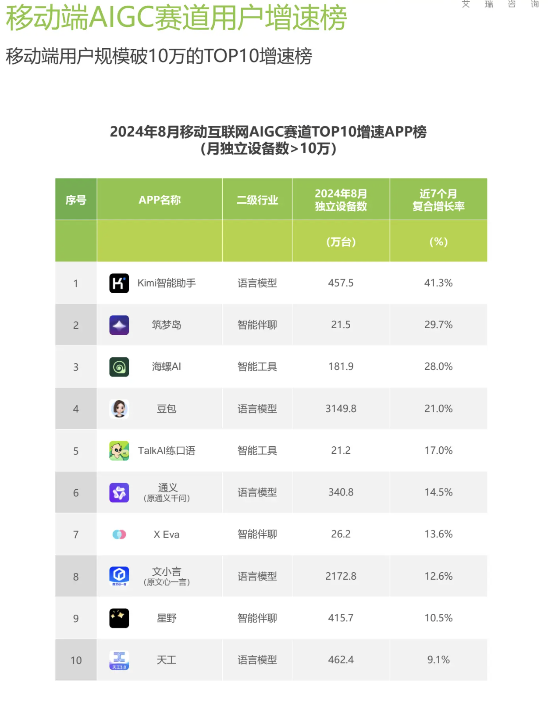

## 大模型是什么

 大语言模型（Large Language Models，LLMs）是一种自然语言处理模型，基于大量的文本数据进行训练，并拥有**海量的参数**。当前的大模型（如 ChatGPT）采用 Transformer 架构，并通过 Reinforcement Learning from Human Feedback (RLHF) 进行训练的人工智能模型。它们的核心工作原理是通过预测下一个词或字来生成句子，并通过强化学习技术进行优化，使其更符合人类的常识和期望。

## 大模型解决什么问题

- 文字生成

- 图片生成

- 语音生成

- 视频生成

- 图片识别(摄像头拍照内容识别)
  - 智能驾驶

## 大模型现状

### 国外大模型

**语言大模型**

  
Meta：开源模型LLMA。

1. **LLaMA 1**：Meta于2023年2月首次公开发布了LLaMA 1，这是其进军开源大模型领域的开篇之作。LLaMA 1基于Transformer架构，包括四种参数规模：7B、13B、33B、65B。与GPT-3相比，LLaMA 1的体积小了10倍以上，但性能优于GPT-3。

2. **LLaMA 2**：时隔5个月，Meta在2023年7月发布了免费可商用版本LLaMA 2，有7B、13B、34B和70B四个参数量版本，除了34B模型外，其他均已开源。相比于LLaMA 1，LLaMA 2将预训练的语料扩充到了2T token，同时将模型的上下文长度从2,048翻倍到了4,096，并引入了分组查询注意力机制（grouped-query attention, GQA）等技术。

3. **LLaMA 3**：2024年4月，Meta官宣了LLaMA 3，作为LLaMA系列的第三代模型，LLaMA 3在多个基准测试中实现了全面领先，性能优于业界同类最先进的模型。LLaMA 3在架构层面，选择了标准的仅解码（decoder-only）式Transformer架构，采用包含128K token词汇表的分词器。LLaMA 3在Meta自制的两个24K GPU集群上进行预训练，使用了超过15T的公开数据，其中5%为非英文数据，涵盖30多种语言，训练数据量是前代LLaMA 2的七倍，包含的代码数量是LLaMA 2的四倍。

**图像生成**
**Midjourney** 公司是在2021**年**8月成立的，由位于美国旧金山的独立研究室Midtrivey 开发，在2022**年**7月开启公测，公司在推出仅六个月后就实现了盈利。

### 国内大模型

  

  

  

Kimi ：超长上下文和成本，通过营销获客快速积累了用户量。
豆包：语音、工作流搭建智能体，还可以使用chatgpt模型。

### AI应用

#### 按类型划分

- 文字
  - 办公（写作、文案、创意广告）
  - 翻译
  - 编程
  - 数字人（伴侣）
  - 基础研究（生物、蛋白质预测）
  设计航天器零部件
   > 麦克莱兰先生的工作是设计既轻又坚固的任务硬件，这是一个一直需要大量试错的工作。但是，一个人类可能需要一个星期才能做几次迭代，而他使用的商业 AI 工具可以在一个小时内生成 30 或 40 个想法，还会提出一些人类想不到的想法。  

- 图片(视觉)
  - 写作
  - 营销
  - 广告
  - 儿童教育(绘本/迷宫)
  - 机器人

- 语音
  - 数字人（伴侣）
  - AI助手
  - 音乐/艺术

- 视频

- 3D

#### 按行业划分

- AI+教育
  - 外语：学习
  - 外语：考试
  - 阅读
  - 调研
  - 生物学
  - 数学
  - 化学

- AI+工作
  - 办公：PPT
  - 办公：Excel
  - 办公：邮件
  - 办公：会议总结
  - HR：团队绩效
  - HR：面试
  - 
  
- AI+自媒体

- AI+生活

  ChatGPT 帮我制定护肤方案，两个月让我的皮肤变成了样

- AI+游戏

- AI+艺术/音乐

- AI+电商

#### 总结

AI 在各个行业中展现了广泛的应用场景，从提升效率到创造新价值，其潜力几乎覆盖了所有领域。在广泛应用的同时，也面临一些挑战和问题，其中之一就是**幻觉**（AI Hallucination）。但是我相信合理利用加上与人类的合作会产生奇妙的化学反应。

### 行业现状（艾瑞）

#### 语言模型

  
豆包拥有一系列先进的语音技术模型，包括语音合成模型和语音识别模型。

 KiMI对标国外的Perplexity：**长文本处理能力**，**搜索引用溯源**。

#### 智能工具

  

#### 图像处理

  

#### APP用户增速

  

### 大模型营收现状

#### 模收费式

  大模型行业主要分为基础模型研究和上层应用。基础模型分为文本、语音和多模态模型（图文视频）。主要收入模式主要有3种：模型使用费（需要消化算力资源）、应用收费和企业定制化模型.

  应用收费：主要是会员订阅制。国外一般是10～20$每月，有openAI、Github copilot、Cursor等。国内大部分还是对用户免费。

### 国内外大模型对比

### 技术能力对比

| **技术能力维度**  | **国际大模型（如 GPT 系列）**       | **国内大模型（如文心一言、智谱AI）** |
| ----------- | ------------------------- | --------------------- |
| **知识理解**    | 跨领域知识融合能力强，知识覆盖广泛         | 在中文场景表现优异，但跨领域知识覆盖较弱  |
| **推理能力**    | 在复杂推理、逻辑任务中表现出色           | 推理能力逐步提升，但与国际大模型仍有差距  |
| **数学与代码处理** | 数学计算精准，代码生成能力强            | 数学和编程任务表现较弱，是短板之一     |
| **多模态能力**   | 先进的多模态生成与理解能力，如图像、语音和文本结合 | 多模态能力快速发展，但整体仍落后于国际水平 |
| **参数规模**    | 参数量更大，模型规模庞大              | 参数规模逐步增长，逐步缩小与国际模型的差距 |

**具体对比分析：**

- **模型规模：** 目前中文大模型在参数量上虽然不断增大，但与GPT系列等外文大模型相比，仍有一定差距。
- **训练数据：** 中文大模型的训练数据主要集中在中文领域，导致在处理多语言任务时表现相对较弱。
- **开源程度：** 中文大模型的开源生态正在逐步完善，但与国外相比，开源模型的数量和质量仍有待提升。
- **擅长领域：** 中文大模型在中文自然语言处理任务上表现出色，但在多语言任务、代码生成、复杂推理等方面与外文大模型相比仍有差距。
- **性能：** 在中文任务上，中文大模型的性能已经达到较高水平。但在多语言任务、复杂推理等任务上，与外文大模型相比仍有提升空间。
- **商业化应用：** 中文大模型的商业化应用正在加速，但在应用场景的广度和深度上与外文大模型相比仍有一定差距。
- **算力支持：** 中国拥有丰富的算力资源，但高端芯片的依赖进口一定程度上限制了大模型的发展。

**造成差距的原因：**

- **数据质量和数量：** 高质量的多语言数据是训练大模型的基础，而中文高质量数据的数量和多样性相对较少。
- **算法创新：** 外国在基础模型算法方面积累了更丰富的经验。
- **算力支持：** 高端芯片的短缺限制了大模型的训练和部署。
- **生态建设：** 开源生态的成熟度影响了大模型的发展速度。

**未来发展趋势：**

- **模型规模继续扩大：** 大模型的参数量将继续增长，以提升模型的性能。
- **多模态发展：** 大模型将向多模态方向发展，能够处理文本、图像、视频等多种数据。
- **开源生态繁荣：** 开源大模型的数量和质量将进一步提升，推动大模型技术的发展。
- **商业化应用加速：** 大模型将在更多的领域实现商业化应用，推动产业升级。

普遍认为中美大模型差距在1年左右。 自从去年推出GPT4o后遇到了瓶颈，迟迟没有推出GPT5。开源模型有meta（Facebook）推出的llama也呈现追赶趋势，国内开源模型用得较多的是ChatGLM（智谱清言-清华系）, 其中ChatGLM-6B在github上有40.7k👍点赞数。

**排行榜**

### 国内大模型应用场景

**ChatGLM(Phone use)**

**Robotic Process Automation**(PRA)工具

**百度秒哒**

## 科大讯飞大模型现状

### 概述

  **AI硬件销售增长**：科大讯飞在2024年“双11”期间的AI硬件销售额同比增长65%，其AI学习机、智能办公本、翻译机等产品在京东和天猫六个品类中获得销售额冠军。这显示了科大讯飞AI硬件产品的强劲市场表现和消费者对智能产品的高度认可。

  **大模型技术应用**：科大讯飞的讯飞星火大模型4.0 Turbo在七大核心能力上显著提升，为科大讯飞AI硬件产品的智能化升级提供了有力支撑。该模型在逻辑推理、语言理解、文本生成、数学答题、代码、多模态各个能力方面均实现大幅提升，进一步逼近GPT-4 Turbo的最新水平。

  **行业合作与应用场景**：科大讯飞已与各头部企业共建20多个行业大模型，覆盖300+应用场景。科大讯飞的AI技术在教育、医疗、智慧城市、运营商、汽车、金融等重点赛道实现了应用落地。

  **教育领域的AI应用**：科大讯飞坚持用AI赋能教育，提供覆盖学校教学、教师发展、智慧考试、素质教育、自主学习等教育全场景的产品和服务。科大讯飞AI学习机作为高端学习机领导者，凭借AI 1对1答疑辅导、AI精准学、AI提优课等功能为孩子学习省时提效。

  **AI for Science**：科大讯飞董事长刘庆峰提出AI for Science成为科技发展新引擎，推动科研革新与应用。科大讯飞通过AI技术在科研领域的应用，为科技发展带来新的动力。

  **国产算力平台**：科大讯飞与华为联合发布首个支撑万亿参数大模型训练的万卡国产算力平台“飞星一号”，基于该平台训练完成的“讯飞星火 V3.5”于2024年1月30日发布，进一步巩固了科大讯飞在AI硬件市场的领先地位。

### 科大讯飞财务报表分析

#### “讯飞星火”大模型成为央国企首选

  2024年1-9月，中国大模型招投标市场活跃，公布的中标项目数量达到653个，中标金额达20.75亿元，相比2023年全年增长了163%。科大讯飞成功中标38个项目，披露的中标金额为2.16亿元，占比**10%**。科大讯飞还将首次发布多模态视觉交互及超拟人虚拟人交互能力，面向万物智联打造极致人机交互体验，还会在教育、医疗、科研、司法、政务等领域升级行业大模型

#### 教育领域和消费者收入占比最高

  教育领域和开放平台在业务收入中的占比分别为30.67%和25.14%，合计占比为55.81%。

#### 收入

**收入占比**

| 业务领域            | 占比（%） | 收入（百万）  | 同比增长（%） |
| --------------- | ----- | ------- | ------- |
| 教育领域：教育产品和服务    | 30.67 | 2859.71 | 25.14   |
| 开放平台及消费者业务：开放平台 | 25.14 | 2344.60 | 47.92   |
| 智能硬件            | 9.65  | 899.87  | 56.61   |
| 其他业务            | 34.54 | -       | -       |

  其他业务包括教育教学业务、智慧城市、运营商相关业务、智慧金融、智慧汽车、智慧医疗等

#### 支出

  自2023年以来累计支出50亿，其中研发支出33亿，服务器支持17亿。

**研发费用**

- 2023年科大讯飞对讯飞星火认知大模型的研发总投入超过20亿元。
- 2024年，上半年围绕大模型相关的总投入达13亿

**服务器**

- 2023年购置17亿元服务器: 仅在2023年，科大讯飞就购置了价值17亿元的服务器设备，用于支持大模型的训练。这些服务器的折旧成本也相当可观，每年至少需要摊销3亿多元。

#### 营收分析

  自2008年上市至2021年，科大讯飞始终保持两位数营收增长的好成绩。2024年半年度报告是其自上市以来，首次交出半年亏损的成绩单。尽管公司上半年实现营收93.25亿元，同比增长18.91%，但净利润却亏损至4.01亿元，同比下降644.59%；扣非后净利润继续亏损4.83亿元，同比下降58.86%，上年同期则亏损3.04亿元，亏损进一步扩大。

**利润表**

| 项目 | 2024-09-30（百万） | 2024-06-30（百万） | 2024-03-31（百万） | 2023-12-31（百万） |
| --- | --- | --- | --- | --- |
| **营业利润** | -475.47 | -530.77 | -323.34 | 429.26 |
| **利润总额** | -540.76 | -592.15 | -327.79 | 419.77 |
| **净利润** | -343.70 | -400.67 | -300.47 | 657.31 |

### 教育领域的产品和服务

  科大讯飞的智慧教育业务涵盖了K12教育阶段的多个场景，包括教学、学习、管理和考试。其主要产品和服务包括：  
  
   **智慧课堂**：通过构建“云一台一端”的整体架构，支持线上线下一体化的教学环境，促进交互式学习[2](https://www.vzkoo.com/read/137b8f2ae51f68d0d47346dc48491991.html)[3](https://edu.iflytek.com/about-us/company)。

   **智学网**：一个基于人工智能和大数据分析的精准教学平台，提供个性化学习方案，包含学生、家长和教师端的应用[2](https://www.vzkoo.com/read/137b8f2ae51f68d0d47346dc48491991.html)[3](https://edu.iflytek.com/about-us/company)。

   **智能考试系统**：用于中高考的英语口语考试系统，推动语言评测技术的应用[3](https://edu.iflytek.com/about-us/company)。

   **区域教育云平台**：为教育机构提供统一的数据规范和服务标准，以支持区域内的教育生态系统建设[2](https://www.vzkoo.com/read/137b8f2ae51f68d0d47346dc48491991.html)。

   **AI学习机**：支持自主学习，通过智能设备帮助学生提高学习效率[4](http://duchuang.sznews.com/content/mb/2023-01/31/content_30054403.html)。

### 开放平台及消费者业务

  在开放平台及消费者业务方面，科大讯飞提供多种智能硬件和软件产品，包括：  
  
   **智能翻译器**：支持60种语言的实时翻译，简化跨语言交流[1](https://www.iflytek.com/en/)。

   **智能录音笔**：能够将语音实时转录为文本，提高会议和访谈记录的效率[1](https://www.iflytek.com/en/)。

   **AI Speakerphone M2**：用于高效远程会议的智能设备，提升沟通效果[1](https://www.iflytek.com/en/)。

   **智能字典笔**：作为便携式语言学习工具，为用户提供即时翻译和学习支持[1](https://www.iflytek.com/en/)。

## 大模型在心理学领域研究

### 对话咨询

#### SoulChat（灵心）

  中文儿童情感陪伴大模型“巧板”，专注于儿童心理健康领域。

  基于主动健康的主动性、预防性、精确性、个性化、共建共享、自律性六大特征，华南理工大学未来技术学院-广东省数字孪生人重点实验室开源了中文领域生活空间主动健康大模型基座ProactiveHealthGPT 可以帮助学术界加速大模型在慢性病、心理咨询等主动健康领域的研究与应用。

- 样例

#### MindChat（漫谈）

  心理大模型，期望从心理咨询、心理评估、心理诊断、心理治疗四个维度帮助人们纾解心理压力与解决心理困惑。模型基座采用MindChat-InternLM-7B、MindChat-Qwen-7B以及MindChat-Baichuan-13B。

#### 林间聊愈室App

  林间聊愈室是一款提供24小时AI陪伴的心理健康应用，为人们提供一个安全、私密的环境，在这里可以随时随地分享他们的感受和经历。以下是林间聊愈室的主要功能和使用场景：

  **AI心灵伙伴**：24小时在线的AI陪伴，用户可以随时倾诉情绪。

  **情绪倾诉**：通过文字或语音与AI小动物交流，分享感受和烦恼。

  **情绪分析**：测量用户的情绪占比，并运用心理技法帮助分析和整理情绪 。

  **读心卡牌**：通过抽卡和回答问题，帮助用户解读自己的性格和情绪状态 。

  **个性化问候**：聊愈后收到AI小动物寄来的明信片和温暖问候 。

  **时空对话**：一周后，用户可以与一周前的自己进行对话，回顾情绪变化 。

#### 心光APP

  心光APP是一款AI驱动的生活记录和日记工具，旨在帮助用户轻松记录日常生活、心情和想法，并通过智能分析提供有价值的信息和洞见。以下是心光App的主要功能和使用场景：

  **时间轴记录**：自动记录时间戳、地理位置，方便补记和修改时间 。

  **心光影集**：支持图文记录，高清不限制数量，精美收藏每张图文 。

  **心光水晶球**：与专属大模型AI对话，分享生活、讨论建议，寻求安慰 。

  **智能事件分类**：自动归类工作、美食、学习、运动等生活记录 。

  **情绪心情识别**：从用户文字中读懂心情，提供情绪反馈 。

  **多种梳理收纳**：自动从事件、情绪、高频词、地图坐标等多角度梳理收纳 。

  **导入导出功能**：支持批量导入过往记录和一键导出所有记录 。

  **隐私保护**：所有功能均在设备自身运行，不收集用户数据，确保隐私安全 。

### 总结

  目前在心理学相关大模型应用还比较少，主要是科研成果相关，基于大模型加上心理咨询对话微调训练而成。心光、林间聊愈室以情绪管理、情感倾诉和心理支持为主。

## 大模型在教育行业的应用

### AI赋能教师

  

### 硬件

- 

## 大模型在编程行业应用

**阿里通义灵码**

**Cursor**

1. 自动创建文件
2. 自动改bug

## 大模型存在的问题

### 模型幻觉与准确性

  **幻觉问题**: 大模型在生成内容时可能产生不准确或误导性的信息，这种现象被称为“幻觉”。这不仅损害了模型的可信度，还可能引发法律和伦理上的风险[3](https://53ai.com/news/LargeLanguageModel/2024091063572.html)[4](https://www.woshipm.com/it/6139992.html)。

  **可解释性不足**: 大模型通常被视为“黑箱”，其决策过程缺乏透明度，这在某些关键领域（如医疗和金融）尤为突出，影响用户的信任

### 数据隐私与安全问题

  **数据隐私保护**: AI大模型在处理敏感数据时，面临数据泄露、滥用和隐私侵犯的风险。法律法规对数据使用的限制使得高质量数据的获取变得更加困难[2](http://www.cbimc.cn/m/content/2024-07/16/content_523908.html)[5](https://www.secrss.com/articles/68921)。

  **合规性挑战**: 在医疗、金融等行业，数据共享受到严格限制，这影响了大模型的训练和应用效果[2](http://www.cbimc.cn/m/content/2024-07/16/content_523908.html)[4](https://www.woshipm.com/it/6139992.html)。

## 参考链接

2. [艾瑞咨询：2024年中国移动互联网AIGC赛道流量报告.pdf](https://waytoagi.feishu.cn/wiki/WvhZwk16WiEnSvk8AcpcdZetnMe?table=tblNyPkA21Dw7t2L&view=vewGyCP4R0)
3. [Al教育硬件全景报告【量子位智库】.pdf](https://waytoagi.feishu.cn/wiki/WvhZwk16WiEnSvk8AcpcdZetnMe?table=tblNyPkA21Dw7t2L&view=vewGyCP4R0)
4. [拾象大模型观察思考](https://waytoagi.feishu.cn/wiki/WvhZwk16WiEnSvk8AcpcdZetnMe?table=tblBU3JnSWPnQSud&view=vewGyCP4R0)
5. [陆奇《新范式 新时代 新机会》北京场](https://waytoagi.feishu.cn/wiki/WvhZwk16WiEnSvk8AcpcdZetnMe?table=tblBU3JnSWPnQSud&view=vewGyCP4R0)
6. [情感计算](https://waytoagi.feishu.cn/wiki/XxlAwSAsmiDjHFkWgvTcSBKsnJg)
7. [大模型遇上心理健康咨询：MeChat、QiaoBan、SoulChat、MindChat四大心理健康领域微调模型总结](https://blog.csdn.net/weixin_42466538/article/details/137226857)
1. [科大讯飞“双11”战绩](https://finance.sina.com.cn/jjxw/2024-11-12/doc-incvuxsf9536132.shtml)
8. [科大讯飞：前三季度实现营收148.5亿元](https://finance.eastmoney.com/a/202410183210891323.html)
9. [大模型，科大讯飞不能输的一战](https://36kr.com/p/2917451863759492)
10. [财务指标](https://q.stock.sohu.com/cn/002230/cwzb.shtml)
11. [ChatGPT 帮我制定护肤方案 两个月让我的皮肤变成了这样](https://xiaohu.ai/p/15402)

