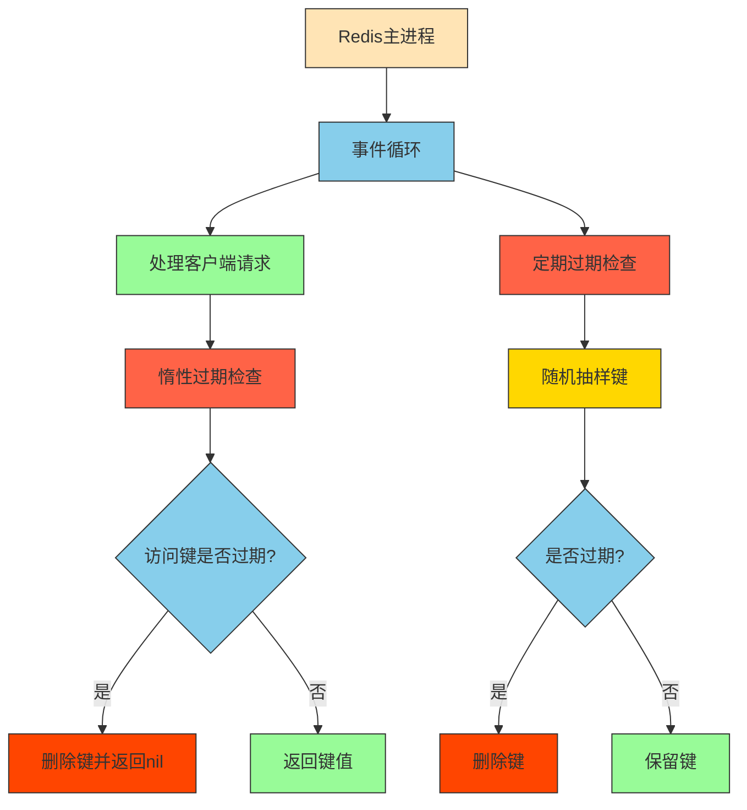
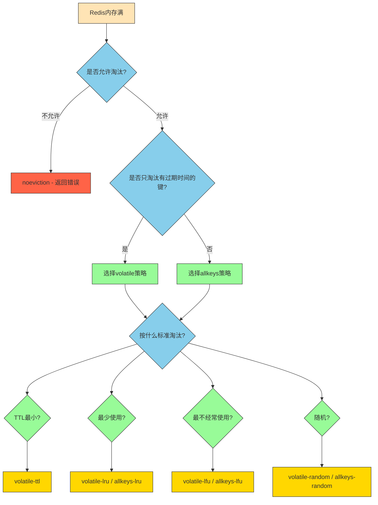
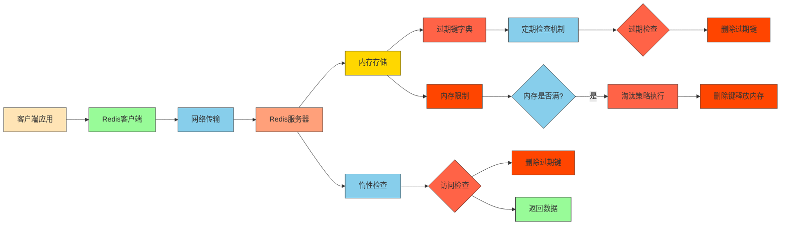

## 1. Redis 过期策略

### 1.1 过期策略概述

Redis 提供了多种键过期策略来管理内存和数据生命周期，主要包括惰性删除和定期删除两种机制的结合。

### 1.2 过期策略类型及原理

#### 1. 惰性过期 (Lazy Expiration)

- 只在访问键时检查是否过期
- 如果过期则删除键并返回空值
- 优点：对CPU友好，只在必要时才检查过期
- 缺点：可能浪费内存，因为过期的键不会被主动清理

#### 2. 定期过期 (Periodic Expiration)

- Redis 定期（默认每秒10次）随机检查部分键是否过期
- 删除已过期的键以回收内存
- 优点：能够及时回收内存
- 缺点：会消耗一定的CPU资源

#### 3. 定时过期 (Timed Expiration)

- 在设置键时指定过期时间
- 到达指定时间后自动删除
- 实际上是通过惰性删除和定期删除机制来实现的

### 1.3 Redis过期策略执行机制详解

Redis的过期策略执行并不需要单独的进程，而是在Redis主进程内部实现的。具体机制如下：

#### 执行方式

1. **非阻塞设计**：过期键检查操作是非阻塞的，不会影响主进程处理客户端请求
2. **事件循环集成**：过期检查集成在Redis的事件循环中，每次事件循环都会执行少量过期检查
3. **时间分片**：将过期检查分散到多个时间点执行，避免集中处理造成延迟

#### 对主进程的影响

1. **CPU占用**：定期过期检查会占用少量CPU时间，但通过配置参数可以控制占用比例
2. **内存回收**：及时回收过期键的内存，避免内存浪费
3. **响应时间**：惰性检查会在客户端访问键时增加微小的延迟（通常微秒级）

#### 内部实现细节



#### 配置参数对性能的影响

1. **hz参数**：控制每秒执行过期检查的频率，默认为10次
   - 值越高，检查越频繁，内存回收更及时，但CPU占用增加
   - 值越低，检查越稀疏，CPU占用减少，但可能导致内存回收延迟

2. **active-expire-effort参数**：控制每次检查的键数量，默认为1
   - 值越高，每次检查更多键，内存回收更彻底，但CPU占用增加
   - 值越低，每次检查较少键，CPU占用减少，但内存回收可能不够及时

#### 性能优化建议

1. 根据业务特点调整hz和active-expire-effort参数
2. 对于大量使用过期键的场景，可以适当提高检查频率
3. 监控CPU使用情况，避免过期检查影响主业务处理

## 2. Redis 不同的过期策略例子

### 2.1 Redis 过期策略概述

Redis 提供了多种键过期策略来管理内存和数据生命周期，主要包括惰性删除和定期删除两种机制的结合。

### 2.2 过期策略类型及原理

#### 1. 惰性过期 (Lazy Expiration)

- 只在访问键时检查是否过期
- 如果过期则删除键并返回空值
- 优点：对CPU友好，只在必要时才检查过期
- 缺点：可能浪费内存，因为过期的键不会被主动清理

#### 2. 定期过期 (Periodic Expiration)

- Redis 定期（默认每秒10次）随机检查部分键是否过期
- 删除已过期的键以回收内存
- 优点：能够及时回收内存
- 缺点：会消耗一定的CPU资源

#### 3. 定时过期 (Timed Expiration)

- 在设置键时指定过期时间
- 到达指定时间后自动删除
- 实际上是通过惰性删除和定期删除机制来实现的

### 2.3 Redis过期策略执行机制详解

Redis的过期策略执行并不需要单独的进程，而是在Redis主进程内部实现的。具体机制如下：

#### 执行方式

1. **非阻塞设计**：过期键检查操作是非阻塞的，不会影响主进程处理客户端请求
2. **事件循环集成**：过期检查集成在Redis的事件循环中，每次事件循环都会执行少量过期检查
3. **时间分片**：将过期检查分散到多个时间点执行，避免集中处理造成延迟

#### 对主进程的影响

1. **CPU占用**：定期过期检查会占用少量CPU时间，但通过配置参数可以控制占用比例
2. **内存回收**：及时回收过期键的内存，避免内存浪费
3. **响应时间**：惰性检查会在客户端访问键时增加微小的延迟（通常微秒级）

#### 内部实现细节


#### 配置参数对性能的影响

1. **hz参数**：控制每秒执行过期检查的频率，默认为10次
   - 值越高，检查越频繁，内存回收更及时，但CPU占用增加
   - 值越低，检查越稀疏，CPU占用减少，但可能导致内存回收延迟

2. **active-expire-effort参数**：控制每次检查的键数量，默认为1
   - 值越高，每次检查更多键，内存回收更彻底，但CPU占用增加
   - 值越低，每次检查较少键，CPU占用减少，但内存回收可能不够及时

#### 性能优化建议

1. 根据业务特点调整hz和active-expire-effort参数
2. 对于大量使用过期键的场景，可以适当提高检查频率
3. 监控CPU使用情况，避免过期检查影响主业务处理

### 1.4 过期命令示例

```bash
# 设置键的过期时间（秒）
EXPIRE mykey 60

# 设置键的过期时间（毫秒）
PEXPIRE mykey 60000

# 设置键在指定时间戳过期（秒）
EXPIREAT mykey 1628086400

# 设置键在指定时间戳过期（毫秒）
PEXPIREAT mykey 1628086400000

# 获取键的剩余生存时间（秒）
TTL mykey

# 获取键的剩余生存时间（毫秒）
PTTL mykey

# 移除键的过期时间
PERSIST mykey
```

### 1.5 不同数据结构的过期示例

#### 字符串 (String)

```bash
SET session_token "abc123" EX 3600  # 1小时后过期
```

#### 哈希 (Hash)

```bash
HSET user:1000 name "Alice" age "25"
EXPIRE user:1000 1800  # 30分钟后过期
```

#### 列表 (List)

```bash
LPUSH recent_activities "user_login"
EXPIRE recent_activities 86400  # 24小时后过期
```

#### 集合 (Set)

```bash
SADD active_users "user1" "user2" "user3"
EXPIRE active_users 300  # 5分钟后过期
```

#### 有序集合 (Sorted Set)

```bash
ZADD leaderboard 100 "player1" 90 "player2"
EXPIRE leaderboard 600  # 10分钟后过期
```

### 1.6 过期策略配置

Redis 的过期策略主要通过配置文件进行调整：

```conf
# redis.conf 中的相关配置
# 设置每秒定时检查过期键的频率 (默认10次)
hz 10

# 设置每次检查过期键的数量 (默认为1)
active-expire-effort 1

# 设置每次检查的最大过期键数量 (默认为20)
active-expire-max 20
```

### 1.7 过期策略效果演示

```mermaid
gantt
    title Redis过期策略执行时间线
    dateFormat  HH:mm:ss
    section 事件循环
    客户端请求处理 : done, des1, 09:00:00, 5ms
    过期检查 : done, des2, 09:00:00, 2ms
    客户端请求处理 : done, des3, 09:00:05, 5ms
    过期检查 : done, des4, 09:00:05, 2ms
    客户端请求处理 : done, des5, 09:00:10, 5ms
    过期检查 : done, des6, 09:00:10, 2ms
    
    section 客户端访问
    访问键A(惰性检查) : crit, active, 09:00:02, 1ms
    访问键B(惰性检查) : crit, active, 09:00:07, 1ms
    访问键C(惰性检查) : crit, active, 09:00:12, 1ms
```



## 2. Redis 缓存淘汰策略

### 2.1 淘汰策略概述

当Redis使用的内存超过`maxmemory`限制时，会根据配置的淘汰策略来删除键，以回收内存空间。Redis提供了多种淘汰策略来适应不同的使用场景。

### 3.2 淘汰策略类型

Redis提供了以下几种淘汰策略：

1. **noeviction**（默认策略）
   - 不淘汰数据，当内存不足时返回错误
   - 适用于不允许丢失数据的场景

2. **allkeys-lru**
   - 从所有键中淘汰最近最少使用的键
   - 适用于键的访问模式符合幂律分布的场景

3. **allkeys-lfu**
   - 从所有键中淘汰最不经常使用的键
   - 适用于需要考虑访问频率的场景

4. **allkeys-random**
   - 从所有键中随机淘汰键
   - 适用于希望均匀分布淘汰的场景

5. **volatile-lru**
   - 仅从设置了过期时间的键中淘汰最近最少使用的键
   - 适用于希望保留未设置过期时间键的场景

6. **volatile-lfu**
   - 仅从设置了过期时间的键中淘汰最不经常使用的键
   - 结合了过期时间和访问频率的考虑

7. **volatile-random**
   - 仅从设置了过期时间的键中随机淘汰键
   - 适用于希望保留未设置过期时间键的场景

8. **volatile-ttl**
   - 仅从设置了过期时间的键中淘汰TTL值最小的键
   - 适用于希望优先淘汰即将过期键的场景

### 3.3 淘汰策略配置

在Redis配置文件中通过`maxmemory-policy`参数设置：

```conf
# redis.conf
# 设置最大内存限制
maxmemory 2mb

# 设置淘汰策略
maxmemory-policy allkeys-lru
```

### 3.4 各策略适用场景



### 3.5 LRU和LFU算法原理

#### LRU (Least Recently Used)

- 淘汰最长时间未被访问的键
- 通过近似算法实现，Redis采用采样方式优化性能


#### LFU (Least Frequently Used)

- 淘汰访问频率最低的键
- 结合了访问频率和时间衰减因子

### 3.6 淘汰策略配置示例

```bash
# 查看当前淘汰策略
CONFIG GET maxmemory-policy

# 设置淘汰策略为allkeys-lru
CONFIG SET maxmemory-policy allkeys-lru

# 设置最大内存为100MB
CONFIG SET maxmemory 100mb
```

### 3.7 淘汰策略性能对比

| 策略 | CPU消耗 | 内存利用率 | 数据命中率 | 适用场景 |
|------|---------|------------|------------|----------|
| noeviction | 最低 | 最低 | 最高 | 不允许数据丢失的场景 |
| allkeys-lru | 中等 | 高 | 高 | 访问模式符合幂律分布 |
| allkeys-lfu | 较高 | 高 | 很高 | 需要考虑访问频率 |
| allkeys-random | 最低 | 中等 | 低 | 均匀分布淘汰需求 |
| volatile-lru | 中等 | 中等 | 中等 | 需要保留部分永久键 |
| volatile-lfu | 较高 | 中等 | 高 | 需要考虑频率且保留永久键 |
| volatile-random | 最低 | 中等 | 低 | 均匀分布且保留永久键 |
| volatile-ttl | 低 | 中等 | 低 | 优先淘汰即将过期键 |

## 3. 总结

### 3.1 Redis 过期策略

1. **核心机制**：Redis采用惰性删除和定期删除相结合的方式管理过期键。

2. **策略类型**：
   - 惰性过期：访问时检查删除
   - 定期过期：定时随机检查删除
   - 定时过期：设置固定过期时间

3. **执行机制**：
   - 不需要单独进程，集成在Redis主进程的事件循环中
   - 通过时间分片和随机抽样避免影响主进程性能
   - 可通过配置参数调整检查频率和强度

### 3.2 Redis 缓存淘汰策略

1. **核心机制**：当内存达到上限时，根据配置策略淘汰键以释放内存。

2. **策略选择**：
   - 根据数据访问模式选择LRU、LFU或随机策略
   - 根据是否允许淘汰所有键选择allkeys或volatile系列策略
   - 特殊场景可选择noeviction策略

3. **配置优化**：合理设置`maxmemory`和`maxmemory-policy`参数以满足业务需求。

### 3.3 整体架构图



## 4. 源码实现分析

### 4.1 过期策略源码分析

Redis的过期策略实现在源码中主要涉及以下几个关键函数和数据结构：

#### 1. 过期键的数据结构

Redis使用一个字典（`expires`字段）来存储所有设置了过期时间的键：

```c
// server.h
typedef struct redisDb {
    dict *dict;                 // 数据库键空间字典
    dict *expires;              // 过期时间字典，保存键和过期时间的映射
    // ... 其他字段
} redisDb;
```

#### 2. 惰性过期检查

当访问一个键时，Redis会调用`expireIfNeeded`函数检查是否过期：

```c
// expire.c
int expireIfNeeded(redisDb *db, robj *key) {
    // 检查键是否过期
    if (!keyIsExpired(db,key)) return 0;
    
    // 删除过期键
    deleteExpiredKeyAndPropagate(db,key);
    return 1;
}

// 检查键是否过期的核心函数
int keyIsExpired(redisDb *db, robj *key) {
    mstime_t when = getExpire(db,key);
    mstime_t now;

    if (when < 0) return 0; // 没有设置过期时间
    
    // 在主从复制中，从节点不主动删除过期键
    if (server.masterhost != NULL) return 0;
    
    now = mstime();
    return now > when;
}
```

#### 3. 定期过期检查

Redis通过`activeExpireCycle`函数实现定期过期检查：

```c
// expire.c
void activeExpireCycle(int type) {
    // ... 初始化变量
    
    // 遍历数据库
    for (i = 0; i < server.dbnum; i++) {
        long sampled = 0;     // 已检查的键数量
        long expired = 0;     // 已过期的键数量
        
        redisDb *db = server.db+i;
        
        // 随机抽取键进行检查
        while (sampled < config_hz && expired < config_expired_max) {
            // 从expires字典中随机获取键
            expired += activeExpireCycleTryExpire(db, now);
            sampled++;
        }
        
        // 如果过期键比例较高，继续下一轮检查
        if (expired * 100 / sampled > 25) {
            goto next;
        }
    }
}

// 检查单个键是否过期
int activeExpireCycleTryExpire(redisDb *db, long long now) {
    // 随机获取一个键
    dictEntry *de = dictGetRandomKey(db->expires);
    if (de == NULL) return 0;
    
    // 获取键名和过期时间
    sds key = dictGetKey(de);
    long long expire_time = dictGetSignedIntegerVal(de);
    
    // 检查是否过期
    if (now > expire_time) {
        // 删除过期键
        robj *keyobj = createStringObject(key, sdslen(key));
        deleteExpiredKeyAndPropagate(db, keyobj);
        decrRefCount(keyobj);
        return 1;
    }
    return 0;
}
```

### 4.2 淘汰策略源码分析

Redis的淘汰策略实现在源码中主要涉及内存管理和键选择算法：

#### 1. 内存检查和淘汰触发

当Redis执行写操作前，会检查内存使用情况：

```c
// server.c
int processCommand(client *c) {
    // ... 其他代码
    
    // 检查是否超出内存限制
    if (server.maxmemory) {
        int retval = freeMemoryIfNeededAndSafe();
        // 如果内存释放失败且策略为noeviction，返回OOM错误
        if (retval == C_ERR) {
            addReply(c, shared.oomerr);
            return C_ERR;
        }
    }
    
    // ... 继续执行命令
}
```

#### 2. 内存释放主函数

```c
// evict.c
int freeMemoryIfNeeded(void) {
    // 获取当前内存使用量
    size_t mem_reported, mem_tofree, mem_freed;
    mem_reported = zmalloc_used_memory();
    
    // 如果未超过内存限制，直接返回
    if (mem_reported <= server.maxmemory) return C_OK;
    
    // 计算需要释放的内存量
    mem_tofree = mem_reported - server.maxmemory;
    mem_freed = 0;
    
    // 根据淘汰策略选择键进行淘汰
    while (mem_freed < mem_tofree) {
        int k;
        
        // 根据maxmemory_policy选择淘汰策略
        switch (server.maxmemory_policy) {
            case MAXMEMORY_ALLKEYS_LRU:
                // 从所有键中选择LRU键淘汰
                freeMemoryIfNeededLRUAllKeys();
                break;
            case MAXMEMORY_ALLKEYS_LFU:
                // 从所有键中选择LFU键淘汰
                freeMemoryIfNeededLFUAllKeys();
                break;
            case MAXMEMORY_VOLATILE_LRU:
                // 从有过期时间的键中选择LRU键淘汰
                freeMemoryIfNeededLRUVolatileKeys();
                break;
            // ... 其他策略
        }
        
        // 更新已释放内存量
        mem_freed += ...; // 实际释放的内存量
    }
    
    return C_OK;
}
```

#### 3. LRU算法实现

Redis使用近似LRU算法来提高性能：

```c
// evict.c
struct evictionPoolEntry {
    unsigned long long idle;  // 空闲时间
    sds key;                  // 键名
    sds cached;               // 缓存的键名
    int dbid;                 // 数据库ID
};

// 近似LRU算法实现
#define EVPOOL_SIZE 16
static struct evictionPoolEntry *EvictionPoolLRU;

// 填充淘汰池
void evictionPoolPopulate(int dbid, dict *sampledict, dict *keydict, struct evictionPoolEntry *pool) {
    int j, removed = 0;

    // 随机采样键
    for (j = 0; j < server.maxmemory_samples; j++) {
        // 随机获取键
        dictEntry *de = dictGetRandomKey(sampledict);
        if (!de) continue;
        
        // 计算空闲时间（LRU算法核心）
        unsigned long long idle = estimateObjectIdleTime(de);
        
        // 将键添加到淘汰池中
        // ... 具体实现
    }
}

// 估算对象空闲时间
unsigned long long estimateObjectIdleTime(robj *o) {
    // LRU算法：当前时间 - 最后访问时间
    unsigned long long lruclock = LRU_CLOCK();
    if (lruclock >= o->lru) {
        return (lruclock - o->lru) * LRU_CLOCK_RESOLUTION;
    } else {
        // 处理时钟回绕
        return (lruclock + (LRU_CLOCK_MAX - o->lru)) * LRU_CLOCK_RESOLUTION;
    }
}
```

#### 4. LFU算法实现

Redis 4.0引入了LFU（Least Frequently Used）算法：

```c
// object.c
// 更新LFU计数器
void updateLFU(robj *val) {
    unsigned long counter = LFUDecrAndReturn(val);
    counter = LFULogIncr(counter);
    val->lru = (LFUGetTimeInMinutes()<<8) | counter;
}

// LFU计数器递减（时间衰减）
uint8_t LFUDecrAndReturn(robj *o) {
    // 获取当前分钟数
    long long epoch = server.lru_clock / LFU_MINUTES_INTERVAL;
    uint8_t counter = LFUGetCounter(o);
    
    // 如果距离上次更新已过去一定时间，进行衰减
    if (epoch != LFUEpoch(o)) {
        // 根据时间间隔进行衰减
        counter = counter >> (epoch - LFUEpoch(o));
    }
    return counter;
}

// LFU计数器递增（对数增长）
uint8_t LFULogIncr(uint8_t value) {
    // 达到最大值后不再增长
    if (value == 255) return value;
    
    // 概率性递增，避免计数器过快增长
    double r = (double)rand()/RAND_MAX;
    double baseval = value;
    if (r < 1.0/(baseval*server.lfu_log_factor+1)) {
        value++;
    }
    return value;
}
```
